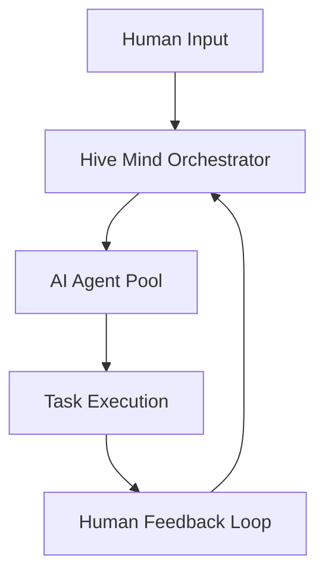

# Hive Mind 🧠

[](https://gitpod.io/#https://github.com/deep-assistant/hive-mind)
[](https://github.com/codespaces/new?hide_repo_select=true&ref=main&repo=deep-assistant/hive-mind)

**AI Orchestration System** - Master mind AI that controls a hive of AI agents, with human-in-the-loop capabilities.

## 🚀 Quick Start

### Installation
```bash
curl -fsSL -o- https://github.com/deep-assistant/hive-mind/raw/refs/heads/main/ubuntu-24-server-install.sh | bash
```

### Core Operations
```bash
# Solve GitHub issues automatically
./solve.mjs https://github.com/owner/repo/issues/123 --fork

# Run collaborative review process
./review.mjs --repo owner/repo --pr 456

# Start hive orchestration
./hive.mjs --mode collaborative --agents 5
```

## 📋 Core Components

| Script | Purpose | Key Features |
|--------|---------|--------------|
| `solve.mjs` | GitHub issue solver | Auto fork, branch, solve, PR |
| `hive.mjs` | AI orchestration | Multi-agent coordination |
| `review.mjs` | Code review automation | Collaborative AI reviews |
| `reviewers-hive.mjs` | Review team management | Reviewer assignment |

## 🏗️ Architecture

The Hive Mind operates on three layers:

1. **Orchestration Layer** (`hive.mjs`) - Coordinates multiple AI agents
2. **Execution Layer** (`solve.mjs`, `review.mjs`) - Performs specific tasks
3. **Human Interface Layer** - Enables human-AI collaboration

### Data Flow


## 🔧 Configuration

### Environment Variables
```bash
export GITHUB_TOKEN="your_token_here"
export CLAUDE_API_KEY="your_key_here"
export HIVE_MODE="collaborative"  # or "autonomous"
```

### Agent Configuration
```javascript
// hive.config.js
export const agents = {
  solver: { model: "sonnet", priority: "high" },
  reviewer: { model: "haiku", priority: "medium" },
  coordinator: { model: "opus", priority: "critical" }
};
```

## 📊 Usage Examples

### Automated Issue Resolution
```bash
# Fork and solve issue with full automation
./solve.mjs https://github.com/owner/repo/issues/123 --fork --auto-merge

# Solve with human review checkpoints
./solve.mjs https://github.com/owner/repo/issues/123 --interactive
```

### Multi-Agent Code Review
```bash
# 3-agent review with conflict resolution
./reviewers-hive.mjs --agents 3 --consensus-threshold 0.8

# Review with domain experts
./review.mjs --experts security,performance,ux
```

## 🔍 Monitoring & Logging

Find resume commands in logs:
```bash
grep -E '\(cd /tmp/gh-issue-solver-[0-9]+ && claude --resume [0-9a-f-]{36}\)' hive-*.log
```

## 🤝 Human-AI Collaboration

The system supports bidirectional communication:
- **Requirements gathering** from humans
- **Expert consultation** on complex decisions  
- **Feedback integration** for continuous improvement
- **Quality assurance** through human oversight

## 📚 Documentation Structure

- [`docs/`](./docs/) - Detailed documentation (auto-generated, <1000 lines per file)
- [`examples/`](./examples/) - Working code examples with types
- [`tests/`](./tests/) - Automated test suites

## 🛡️ File Size Enforcement

All documentation files are automatically checked:
```bash
find docs/ -name "*.md" -exec wc -l {} + | awk '$1 > 1000 {print "ERROR: " $2 " has " $1 " lines (max 1000)"}'
```

## 📄 License

MIT License - see [LICENSE](./LICENSE)

## 🤖 Contributing

This project uses AI-driven development. See [CONTRIBUTING.md](./docs/CONTRIBUTING.md) for human-AI collaboration guidelines.