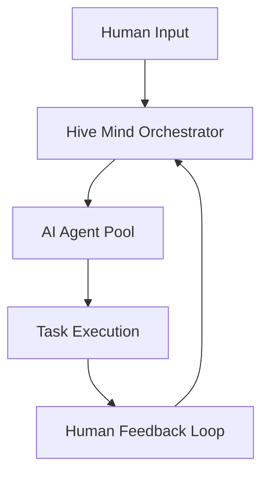

# Hive Mind 🧠

[](https://gitpod.io/#https://github.com/deep-assistant/hive-mind)
[](https://github.com/codespaces/new?hide_repo_select=true&ref=main&repo=deep-assistant/hive-mind)

**The master mind AI that controls hive of AI.** The orchestrator AI that controls AIs. The HIVE MIND. The SWARM MIND.

It is also possible to connect this AI to collective human intelligence, meaning this system can communicate with humans for requirements, expertise, feedback.

## ⚠️ WARNING

It is UNSAFE to run this software on your developer machine.

It is recommended to use SEPARATE Ubuntu 24.04 installation (installation script is prepared for you).

This software uses full autonomous mode of Claude Code, that means it is free to execute any commands it sees fit.

That means it can lead to unexpected side effects.

There is also a known issue of space leakage. So you need to make sure you are able to reinstall your virtual machine to clear space and/or any damage to the virtual machine.

Minimum system requirements to run `hive.mjs`:
```
1 CPU Core
1 GB RAM
> 2 GB SWAP
50 GB disk space
```

## 🚀 Quick Start

### Installation
```bash
curl -fsSL -o- https://github.com/deep-assistant/hive-mind/raw/refs/heads/main/ubuntu-24-server-install.sh | bash
```

### Core Operations
```bash
# Solve GitHub issues automatically
./solve.mjs https://github.com/owner/repo/issues/123 --fork --model sonnet

# Continue working on existing PR
./solve.mjs https://github.com/owner/repo/pull/456 --model opus

# Resume from Claude session when limit is reached
./solve.mjs https://github.com/owner/repo/issues/123 --resume session-id

# Start hive orchestration (monitor and solve issues automatically)
./hive.mjs https://github.com/owner/repo --monitor-tag "help wanted" --concurrency 3

# Monitor all issues in organization
./hive.mjs https://github.com/microsoft --all-issues --max-issues 10

# Run collaborative review process
./review.mjs --repo owner/repo --pr 456

# Multiple AI reviewers for consensus
./reviewers-hive.mjs --agents 3 --consensus-threshold 0.8
```

## 📋 Core Components

| Script | Purpose | Key Features |
|--------|---------|--------------|
| `solve.mjs` | GitHub issue solver | Auto fork, branch creation, PR generation, resume sessions, fork support |
| `hive.mjs` | AI orchestration & monitoring | Multi-repo monitoring, concurrent workers, issue queue management |
| `review.mjs` | Code review automation | Collaborative AI reviews, automated feedback |
| `reviewers-hive.mjs` | Review team management | Multi-agent consensus, reviewer assignment |

### solve.mjs Options
```bash
./solve.mjs <issue-url> [options]

  --model, -m         Model (sonnet, opus)                [default: sonnet]
  --fork, -f          Fork repo if no write access       [default: false]
  --resume, -r        Resume from session ID
  --verbose, -v       Enable verbose logging              [default: false]
  --dry-run, -n       Prepare only, don't execute        [default: false]
  --attach-solution-logs  Attach logs to PR (⚠️ sensitive) [default: false]
```

### hive.mjs Options  
```bash
./hive.mjs <github-url> [options]

  --monitor-tag, -t   Label to monitor                   [default: "help wanted"]
  --all-issues, -a    Monitor all issues (ignore labels) [default: false]
  --concurrency, -c   Parallel workers                   [default: 2]
  --max-issues        Limit processed issues             [default: unlimited]
  --interval, -i      Poll interval (seconds)            [default: 300]
  --once              Single run (don't monitor)         [default: false]
  --skip-issues-with-prs  Skip issues with existing PRs  [default: false]
```

## 🏗️ Architecture

The Hive Mind operates on three layers:

1. **Orchestration Layer** (`hive.mjs`) - Coordinates multiple AI agents
2. **Execution Layer** (`solve.mjs`, `review.mjs`) - Performs specific tasks
3. **Human Interface Layer** - Enables human-AI collaboration

### Data Flow


## 🔧 Configuration

### Environment Variables
```bash
export GITHUB_TOKEN="your_token_here"
export CLAUDE_API_KEY="your_key_here"
export HIVE_MODE="collaborative"  # or "autonomous"
```

### Agent Configuration
```javascript
// hive.config.js
export const agents = {
  solver: { model: "sonnet", priority: "high" },
  reviewer: { model: "haiku", priority: "medium" },
  coordinator: { model: "opus", priority: "critical" }
};
```

## 📊 Usage Examples

### Automated Issue Resolution
```bash
# Fork and solve issue (if no write access)
./solve.mjs https://github.com/owner/repo/issues/123 --fork --model opus

# Continue work on existing PR
./solve.mjs https://github.com/owner/repo/pull/456 --verbose

# Solve with detailed logging and solution attachment
./solve.mjs https://github.com/owner/repo/issues/123 --verbose --attach-solution-logs

# Dry run to see what would happen
./solve.mjs https://github.com/owner/repo/issues/123 --dry-run
```

### Multi-Repository Orchestration
```bash
# Monitor single repository with specific label
./hive.mjs https://github.com/owner/repo --monitor-tag "bug" --concurrency 4

# Monitor all issues in an organization
./hive.mjs https://github.com/microsoft --all-issues --max-issues 20 --once

# Monitor user repositories with high concurrency
./hive.mjs https://github.com/username --all-issues --concurrency 8 --interval 120

# Skip issues that already have PRs
./hive.mjs https://github.com/org/repo --skip-issues-with-prs --verbose
```

### Session Management
```bash
# Resume when Claude hits limit
./solve.mjs https://github.com/owner/repo/issues/123 --resume 657e6db1-6eb3-4a8d

# Continue session interactively in Claude Code
(cd /tmp/gh-issue-solver-123456789 && claude --resume session-id)
```

## 🔍 Monitoring & Logging

Find resume commands in logs:
```bash
grep -E '\(cd /tmp/gh-issue-solver-[0-9]+ && claude --resume [0-9a-f-]{36}\)' hive-*.log
```

## 🤝 Human-AI Collaboration

The system supports bidirectional communication:
- **Requirements gathering** from humans
- **Expert consultation** on complex decisions  
- **Feedback integration** for continuous improvement
- **Quality assurance** through human oversight

## 📚 Documentation Structure

- [`docs/`](./docs/) - Detailed documentation (auto-generated, <1000 lines per file)
- [`examples/`](./examples/) - Working code examples with types
- [`tests/`](./tests/) - Automated test suites

## 🛡️ File Size Enforcement

All documentation files are automatically checked:
```bash
find docs/ -name "*.md" -exec wc -l {} + | awk '$1 > 1000 {print "ERROR: " $2 " has " $1 " lines (max 1000)"}'
```

## 📄 License

MIT License - see [LICENSE](./LICENSE)

## 🤖 Contributing

This project uses AI-driven development. See [CONTRIBUTING.md](./docs/CONTRIBUTING.md) for human-AI collaboration guidelines.