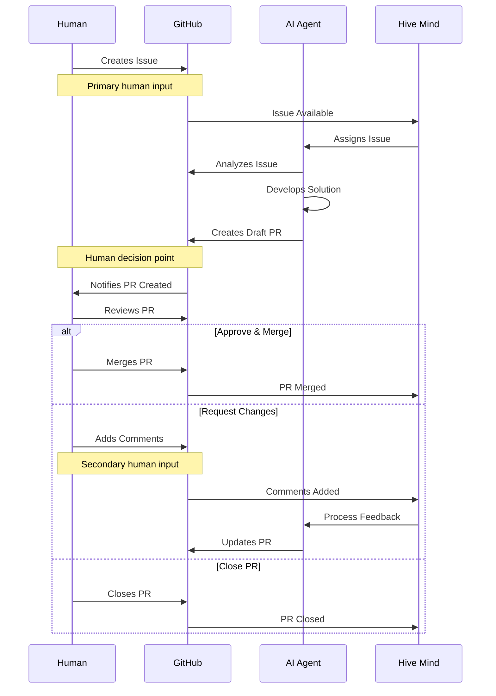
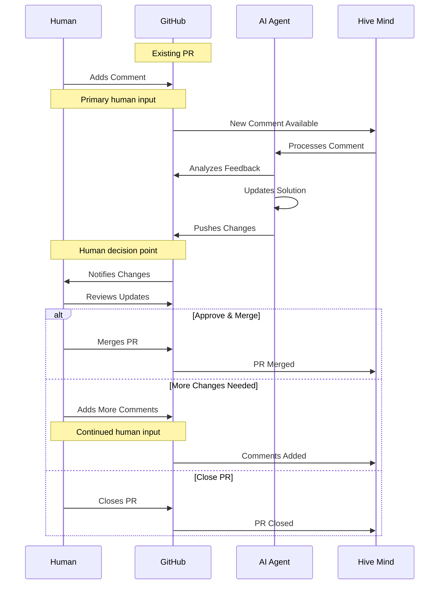

[](https://npmjs.com/@deep-assistant/hive-mind)
[](https://github.com/deep-assistant/hive-mind/blob/main/LICENSE)
[](https://github.com/deep-assistant/hive-mind/stargazers)

[](https://gitpod.io/#https://github.com/deep-assistant/hive-mind)
[](https://github.com/codespaces/new?hide_repo_select=true&ref=main&repo=deep-assistant/hive-mind)

# Hive Mind 🧠

**The master mind AI that controls hive of AI.** The orchestrator AI that controls AIs. The HIVE MIND. The SWARM MIND.

It is also possible to connect this AI to collective human intelligence, meaning this system can communicate with humans for requirements, expertise, feedback.

## ⚠️ WARNING

It is UNSAFE to run this software on your developer machine.

It is recommended to use SEPARATE Ubuntu 24.04 installation (installation script is prepared for you).

This software uses full autonomous mode of Claude Code, that means it is free to execute any commands it sees fit.

That means it can lead to unexpected side effects.

There is also a known issue of space leakage. So you need to make sure you are able to reinstall your virtual machine to clear space and/or any damage to the virtual machine.

Minimum system requirements to run `hive.mjs`:
```
1 CPU Core
1 GB RAM
> 2 GB SWAP
50 GB disk space
```

## 🚀 Quick Start

### Global Installation

#### Using Bun (Recommended)
```bash
bun install -g @deep-assistant/hive-mind
```

#### Using Node.js
```bash
npm install -g @deep-assistant/hive-mind
```

### Installation on Ubuntu 24.04 server
```bash
curl -fsSL -o- https://github.com/deep-assistant/hive-mind/raw/refs/heads/main/ubuntu-24-server-install.sh | bash
```

### Core Operations
```bash
# Solve using maximum power
solve https://github.com/Veronika89-lang/index.html/issues/1 --auto-continue --attach-logs --verbose --model opus --fork --think max

# Solve GitHub issues automatically
solve https://github.com/owner/repo/issues/123 --fork --model sonnet

# Solve issue with PR to custom branch
solve https://github.com/owner/repo/issues/123 --base-branch develop --fork

# Continue working on existing PR
solve https://github.com/owner/repo/pull/456 --model opus

# Resume from Claude session when limit is reached
solve https://github.com/owner/repo/issues/123 --resume session-id

# Start hive orchestration (monitor and solve issues automatically)
hive https://github.com/owner/repo --monitor-tag "help wanted" --concurrency 3

# Monitor all issues in organization
hive https://github.com/microsoft --all-issues --max-issues 10

# Run collaborative review process
review --repo owner/repo --pr 456

# Multiple AI reviewers for consensus
./reviewers-hive.mjs --agents 3 --consensus-threshold 0.8
```

## 📋 Core Components

| Script | Purpose | Key Features |
|--------|---------|--------------|
| `solve.mjs` (stable) | GitHub issue solver | Auto fork, branch creation, PR generation, resume sessions, fork support |
| `hive.mjs` (stable) | AI orchestration & monitoring | Multi-repo monitoring, concurrent workers, issue queue management |
| `review.mjs` (alpha) | Code review automation | Collaborative AI reviews, automated feedback |
| `reviewers-hive.mjs` (alpha / experimental) | Review team management | Multi-agent consensus, reviewer assignment |
| `telegram-bot.mjs` (stable) | Telegram bot interface | Remote command execution, group chat support, diagnostic tools |

## 🔧 solve Options
```bash
solve <issue-url> [options]

  --model, -m           Model (sonnet, opus)                  [default: sonnet]
  --fork, -f            Fork repo if no write access         [default: false]
  --base-branch, -b     Target branch for PR                  [default: repo default]
  --resume, -r          Resume from session ID
  --verbose, -v         Enable verbose logging                [default: false]
  --dry-run, -n         Prepare only, don't execute          [default: false]
  --auto-continue       Continue work on existing PRs        [default: false]
  --auto-pull-request-creation  Create draft PR before Claude [default: false]
  --attach-logs           Attach logs to PR (⚠️ sensitive)   [default: false]
  --think               Thinking level (low, medium, high, max)  [optional]
```

## 🔧 hive Options
```bash
hive <github-url> [options]

  --monitor-tag, -t     Label to monitor                     [default: "help wanted"]
  --all-issues, -a      Monitor all issues (ignore labels)   [default: false]
  --concurrency, -c     Parallel workers                     [default: 2]
  --max-issues          Limit processed issues               [default: unlimited]
  --interval, -i        Poll interval (seconds)              [default: 300]
  --once                Single run (don't monitor)           [default: false]
  --skip-issues-with-prs  Skip issues with existing PRs     [default: false]
  --pull-requests-per-issue  Number of PRs per issue        [default: 1]
  --dry-run             List issues without processing       [default: false]
  --verbose, -v         Enable verbose logging               [default: false]
  --min-disk-space      Minimum disk space in MB             [default: 500]
  --auto-cleanup        Clean /tmp/* /var/tmp/* on success   [default: false]
  --fork, -f            Fork repos if no write access       [default: false]
  --auto-continue       Continue work on existing PRs (24h+) [default: false]
```

## 🤖 Telegram Bot

The Hive Mind includes a Telegram bot interface (SwarmMindBot) for remote command execution.

### 🚀 Test Drive

Want to see the Hive Mind in action? Join our Telegram channel where you can execute the Hive Mind on your own issues and watch AI solve them:

**[Join https://t.me/hive_mind_pull_requests](https://t.me/hive_mind_pull_requests)**

### Setup

1. **Get Bot Token**
   - Talk to [@BotFather](https://t.me/BotFather) on Telegram
   - Create a new bot and get your token
   - Add the bot to your group chat and make it an admin

2. **Configure Environment**
   ```bash
   # Copy the example configuration
   cp .env.example .env

   # Edit and add your bot token
   echo "TELEGRAM_BOT_TOKEN=your_bot_token_here" >> .env

   # Optional: Restrict to specific chats
   # Get chat ID using /help command, then add:
   echo "TELEGRAM_ALLOWED_CHATS=123456789,987654321" >> .env
   ```

3. **Start the Bot**
   ```bash
   # Load environment variables and start
   source .env && telegram-bot
   ```

### Bot Commands

All commands work in **group chats only** (not in private messages with the bot):

#### `/solve` - Solve GitHub Issues
```
/solve <github-url> [options]

Examples:
/solve https://github.com/owner/repo/issues/123
/solve https://github.com/owner/repo/issues/123 --fork --verbose
/solve https://github.com/owner/repo/issues/123 --fork --auto-continue --attach-logs --verbose --model sonnet --think max
```

#### `/hive` - Run Hive Orchestration
```
/hive <github-url> [options]

Examples:
/hive https://github.com/owner/repo
/hive https://github.com/owner/repo --all-issues --max-issues 10
/hive https://github.com/microsoft --all-issues --concurrency 3
```

#### `/help` - Get Help and Diagnostic Info
```
/help

Shows:
- Chat ID (needed for TELEGRAM_ALLOWED_CHATS)
- Chat type
- Available commands
- Usage examples
```

### Features

- ✅ **Group Chat Only**: Commands work only in group chats (not private messages)
- ✅ **Full Options Support**: All command-line options work in Telegram
- ✅ **Screen Sessions**: Commands run in detached screen sessions
- ✅ **Chat Restrictions**: Optional whitelist of allowed chat IDs
- ✅ **Diagnostic Tools**: Get chat ID and configuration info

### Security Notes

- Only works in group chats where the bot is admin
- Optional chat ID restrictions via `TELEGRAM_ALLOWED_CHATS`
- Commands run as the system user running the bot
- Ensure proper authentication (`gh auth login`, `claude-profiles`)

## 🏗️ Architecture

The Hive Mind operates on three layers:

1. **Orchestration Layer** (`hive.mjs`) - Coordinates multiple AI agents
2. **Execution Layer** (`solve.mjs`, `review.mjs`) - Performs specific tasks
3. **Human Interface Layer** - Enables human-AI collaboration

### Data Flow

#### Mode 1: Issue → Pull Request Flow


#### Mode 2: Pull Request → Comments Flow


📖 **For comprehensive data flow documentation including human feedback integration points, see [docs/flow.md](./docs/flow.md)**

## 📊 Usage Examples

### Automated Issue Resolution
```bash
# Fork and solve issue (if no write access)
solve https://github.com/owner/repo/issues/123 --fork --model opus

# Continue work on existing PR
solve https://github.com/owner/repo/pull/456 --verbose

# Solve with detailed logging and solution attachment
solve https://github.com/owner/repo/issues/123 --verbose --attach-logs

# Dry run to see what would happen
solve https://github.com/owner/repo/issues/123 --dry-run
```

### Multi-Repository Orchestration
```bash
# Monitor single repository with specific label
hive https://github.com/owner/repo --monitor-tag "bug" --concurrency 4

# Monitor all issues in an organization
hive https://github.com/microsoft --all-issues --max-issues 20 --once

# Monitor user repositories with high concurrency
hive https://github.com/username --all-issues --concurrency 8 --interval 120

# Skip issues that already have PRs
hive https://github.com/org/repo --skip-issues-with-prs --verbose

# Auto-cleanup temporary files and fork repos if needed
hive https://github.com/org/repo --auto-cleanup --fork --concurrency 5
```

### Session Management
```bash
# Resume when Claude hits limit
solve https://github.com/owner/repo/issues/123 --resume 657e6db1-6eb3-4a8d

# Continue session interactively in Claude Code
(cd /tmp/gh-issue-solver-123456789 && claude --resume session-id)
```

## 🔍 Monitoring & Logging

Find resume commands in logs:
```bash
grep -E '\(cd /tmp/gh-issue-solver-[0-9]+ && claude --resume [0-9a-f-]{36}\)' hive-*.log
```

## 🔧 Configuration

Authentication is handled through:
- `gh auth login` - GitHub CLI authentication
- `claude-profiles` - Claude authentication profile migration to server

No environment variable configuration is currently supported.

## 🛡️ File Size Enforcement

All documentation files are automatically checked:
```bash
find docs/ -name "*.md" -exec wc -l {} + | awk '$1 > 1000 {print "ERROR: " $2 " has " $1 " lines (max 1000)"}'
```

## 📄 License

Unlicense License - see [LICENSE](./LICENSE)

## 🤖 Contributing

This project uses AI-driven development. See [CONTRIBUTING.md](./docs/CONTRIBUTING.md) for human-AI collaboration guidelines.