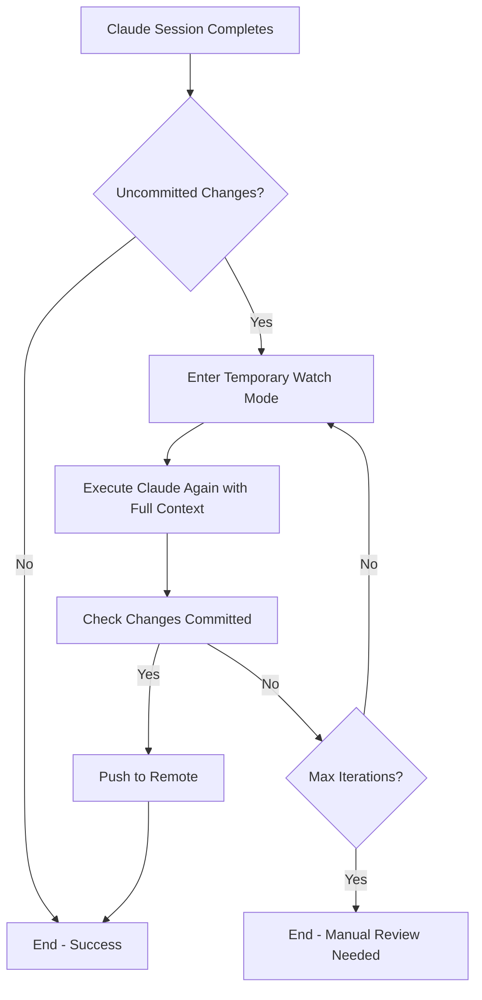
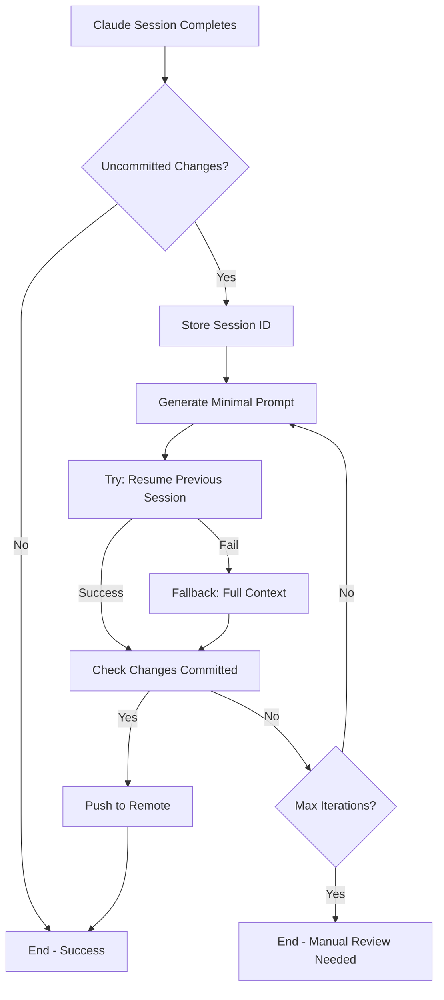

# Implementation Proposal: Session Resume for Auto-Restart Cost Optimization

**Issue**: [#661](https://github.com/deep-assistant/hive-mind/issues/661)
**Status**: 📋 Proposal
**Date**: 2025-11-03

---

## Overview

This document outlines the proposed implementation for optimizing auto-restart token costs using Claude CLI's session resume feature. The goal is to reduce token costs by 95%+ while maintaining solution quality.

## Current Auto-Restart Flow



**Problem**: Step E re-sends 50k-200k tokens of context each time, incurring significant costs.

## Proposed Optimized Flow



**Optimization**: Step F uses `--resume <session-id>` with ~500 tokens instead of 50k-200k.

## Implementation Details

### 1. Store Session ID for Resume

**Location**: `src/solve.mjs` (around line 797-841)

**Current code**:
```javascript
const { success, sessionId } = toolResult;
// ... handling ...

// Check for uncommitted changes
const shouldAutoCommit = argv['auto-commit-uncommitted-changes'] || limitReached;
const autoRestartEnabled = argv['autoRestartOnUncommittedChanges'] !== false;
const shouldRestart = await checkForUncommittedChanges(tempDir, owner, repo, branchName, $, log, shouldAutoCommit, autoRestartEnabled);
```

**Proposed modification**:
```javascript
const { success, sessionId } = toolResult;

// Store session ID for potential resume in auto-restart
global.previousSessionId = sessionId;

// Check for uncommitted changes
const shouldAutoCommit = argv['auto-commit-uncommitted-changes'] || limitReached;
const autoRestartEnabled = argv['autoRestartOnUncommittedChanges'] !== false;
const shouldRestart = await checkForUncommittedChanges(tempDir, owner, repo, branchName, $, log, shouldAutoCommit, autoRestartEnabled);
```

### 2. Create Minimal Restart Prompt Generator

**Location**: New file `src/solve.minimal-restart-prompt.lib.mjs`

```javascript
#!/usr/bin/env node

/**
 * Generate minimal prompt for auto-restart with session resume
 * This prompt assumes the AI has full context from the previous session
 */

export const generateMinimalRestartPrompt = async (tempDir, $) => {
  // Get uncommitted changes
  const gitStatus = await $({ cwd: tempDir })`git status --porcelain`;
  const uncommittedFiles = gitStatus.stdout.toString().trim();

  // Get brief diff summary (not full diff to keep it minimal)
  const gitDiffStat = await $({ cwd: tempDir })`git diff --stat`;
  const diffSummary = gitDiffStat.stdout.toString().trim();

  // Count changes
  const fileCount = uncommittedFiles.split('\n').filter(line => line.trim()).length;

  return `
Auto-restart: Previous session completed with uncommitted changes.

Uncommitted files (${fileCount}):
${uncommittedFiles}

Changes summary:
${diffSummary}

Please review these changes and commit them with an appropriate commit message.
Follow the repository's commit message conventions from previous commits.
  `.trim();
};

/**
 * Generate full context prompt (fallback when resume fails)
 */
export const generateFullRestartPrompt = async (
  issueUrl,
  issueBody,
  prNumber,
  feedbackLines,
  tempDir,
  $
) => {
  // Get uncommitted changes with full diff
  const gitStatus = await $({ cwd: tempDir })`git status --porcelain`;
  const uncommittedFiles = gitStatus.stdout.toString().trim();

  const gitDiff = await $({ cwd: tempDir })`git diff`;
  const fullDiff = gitDiff.stdout.toString();

  let prompt = `
Continuing work on issue: ${issueUrl}

Previous session completed but left uncommitted changes.
  `.trim();

  if (feedbackLines && feedbackLines.length > 0) {
    prompt += `\n\nFeedback from reviewers:\n${feedbackLines.join('\n')}`;
  }

  prompt += `\n\nUncommitted changes:\n${uncommittedFiles}\n\nFull diff:\n${fullDiff}`;

  prompt += `\n\nPlease review these changes and commit them appropriately.`;

  return prompt;
};
```

### 3. Modify Watch Mode to Support Session Resume

**Location**: `src/solve.watch.lib.mjs` (around line 150-250)

**Current restart logic**:
```javascript
// Execute solve command for this PR
const solveCommand = buildSolveCommand(issueUrl, argv, prNumber);
await log(`\n📋 Executing: ${solveCommand}`, { verbose: true });

try {
  const result = await $`${solveCommand}`;
  // ... handle result
}
```

**Proposed modification**:
```javascript
// Build solve command with session resume if available
const solveCommand = buildSolveCommandWithResume(
  issueUrl,
  argv,
  prNumber,
  global.previousSessionId,
  iteration
);

await log(`\n📋 Executing: ${solveCommand}`, { verbose: true });

// Track tokens before restart
const tokensBefore = global.previousSessionId
  ? await calculateSessionTokens(global.previousSessionId, tempDir)
  : null;

try {
  const result = await $`${solveCommand}`;

  // Track tokens after restart
  if (tokensBefore && global.currentSessionId) {
    const tokensAfter = await calculateSessionTokens(global.currentSessionId, tempDir);
    const savedTokens = calculateTokenSavings(tokensBefore, tokensAfter);

    await log(`\n💰 Token savings from session resume:`, { verbose: true });
    await log(`   Previous session: ${tokensBefore.totalTokens} tokens`, { verbose: true });
    await log(`   Current session: ${tokensAfter.totalTokens} tokens`, { verbose: true });
    await log(`   Tokens saved: ${savedTokens.saved} (${savedTokens.percentSaved}%)`, { verbose: true });

    if (savedTokens.costSavedUSD) {
      await log(`   Cost saved: $${savedTokens.costSavedUSD.toFixed(4)}`, { verbose: true });
    }
  }

  // ... handle result
}
```

### 4. Build Solve Command with Resume Support

**Location**: New function in `src/solve.watch.lib.mjs`

```javascript
/**
 * Build solve command with session resume support for auto-restart
 */
const buildSolveCommandWithResume = (issueUrl, argv, prNumber, previousSessionId, iteration) => {
  const baseArgs = [
    process.argv[0],
    process.argv[1],
    issueUrl
  ];

  // Add standard options
  if (argv.model) baseArgs.push('--model', argv.model);
  if (argv.tool) baseArgs.push('--tool', argv.tool);
  if (argv.verbose) baseArgs.push('--verbose');

  // Add session resume if available and this is a restart
  if (previousSessionId && iteration > 0) {
    baseArgs.push('--resume', previousSessionId);
    baseArgs.push('--minimal-restart-context'); // New flag to indicate minimal prompt
  }

  // Add other necessary flags
  baseArgs.push('--auto-continue');

  return baseArgs.join(' ');
};
```

### 5. Add Minimal Restart Mode Support

**Location**: `src/solve.mjs` and `src/solve.preparation.lib.mjs`

**New argv option**:
```javascript
// In solve.config.lib.mjs
.option('minimal-restart-context', {
  description: 'Use minimal context for restart (assumes session resume)',
  type: 'boolean',
  default: false
})
```

**Prompt generation logic**:
```javascript
// In solve.preparation.lib.mjs
export const preparePromptsForSession = async (params) => {
  const { argv, issueUrl, issueBody, prNumber, feedbackLines, tempDir, $ } = params;

  // If minimal restart mode, generate minimal prompt
  if (argv.minimalRestartContext && argv.resume) {
    const minimalPrompt = await generateMinimalRestartPrompt(tempDir, $);

    return {
      prompt: minimalPrompt,
      systemPrompt: '', // Empty system prompt for resume
      isMinimalRestart: true
    };
  }

  // Otherwise generate full context
  // ... existing full prompt generation logic
};
```

### 6. Add Fallback Mechanism

**Location**: `src/claude.lib.mjs` (around line 950-1000)

**Proposed enhancement**:
```javascript
export const executeClaudeWithResumeAndFallback = async (params) => {
  const { argv, tempDir, ...otherParams } = params;

  // If resume is requested, try it first
  if (argv.resume && argv.minimalRestartContext) {
    await log('🔄 Attempting session resume with minimal context...');

    try {
      const resumeResult = await executeClaudeCommand({
        argv,
        tempDir,
        ...otherParams
      });

      // Verify the session understood the context
      // Check if it actually made progress on the uncommitted changes
      const stillHasChanges = await checkForUncommittedChanges(tempDir, $);

      if (!stillHasChanges || resumeResult.success) {
        await log('✅ Session resume successful with minimal context');
        return resumeResult;
      } else {
        throw new Error('Session resumed but did not make progress');
      }
    } catch (resumeError) {
      await log('⚠️ Session resume failed:', { level: 'warning' });
      await log(`   ${resumeError.message}`, { level: 'warning' });
      await log('   Falling back to full context...', { level: 'warning' });

      // Fall back to full context
      // Re-generate full prompt
      const fullPromptData = await generateFullRestartPrompt(
        argv.url,
        // ... other params
      );

      return await executeClaudeCommand({
        argv: { ...argv, resume: undefined, minimalRestartContext: false },
        tempDir,
        prompt: fullPromptData.prompt,
        systemPrompt: fullPromptData.systemPrompt,
        ...otherParams
      });
    }
  }

  // Normal execution without resume
  return await executeClaudeCommand({ argv, tempDir, ...otherParams });
};
```

### 7. Enhanced Token Tracking and Reporting

**Location**: `src/solve.results.lib.mjs`

```javascript
/**
 * Show token savings from session resume
 */
export const showTokenSavings = async (previousTokens, currentTokens, log) => {
  if (!previousTokens || !currentTokens) return;

  const inputSaved = previousTokens.inputTokens - currentTokens.inputTokens;
  const cacheSaved = previousTokens.cacheReadTokens - currentTokens.cacheReadTokens;
  const percentSaved = ((inputSaved + cacheSaved) / previousTokens.totalTokens * 100).toFixed(1);

  await log('');
  await log('💰 Token Usage Comparison (Auto-Restart Optimization)');
  await log('');
  await log(`   Previous session:`);
  await log(`     Input tokens: ${previousTokens.inputTokens.toLocaleString()}`);
  await log(`     Cache read tokens: ${previousTokens.cacheReadTokens.toLocaleString()}`);
  await log(`     Total: ${previousTokens.totalTokens.toLocaleString()}`);
  await log('');
  await log(`   Current session (with resume):`);
  await log(`     Input tokens: ${currentTokens.inputTokens.toLocaleString()}`);
  await log(`     Cache read tokens: ${currentTokens.cacheReadTokens.toLocaleString()}`);
  await log(`     Total: ${currentTokens.totalTokens.toLocaleString()}`);
  await log('');
  await log(`   Tokens saved: ${(inputSaved + cacheSaved).toLocaleString()} (${percentSaved}%)`);

  if (previousTokens.totalCostUSD && currentTokens.totalCostUSD) {
    const costSaved = previousTokens.totalCostUSD - currentTokens.totalCostUSD;
    await log(`   Cost saved: $${costSaved.toFixed(4)}`);
  }
  await log('');
};
```

## Testing Plan

### Phase 1: Unit Tests

1. **Test minimal prompt generation**
   - Verify format is correct
   - Check it includes git status and diff summary
   - Ensure it's under 1000 tokens

2. **Test session ID storage**
   - Verify global.previousSessionId is set correctly
   - Check it persists through watch mode cycles

3. **Test fallback mechanism**
   - Simulate resume failure
   - Verify full context is used
   - Check error logging

### Phase 2: Integration Tests

1. **Test auto-restart with resume**
   - Create test issue with uncommitted changes scenario
   - Verify session resume is triggered
   - Check changes are committed correctly

2. **Test token tracking**
   - Verify tokens are calculated for both sessions
   - Check savings are displayed correctly
   - Validate cost calculations

3. **Test fallback scenario**
   - Force resume to fail (delete session file)
   - Verify fallback to full context works
   - Check solution quality is maintained

### Phase 3: Production Testing

1. **Canary deployment**
   - Enable for 10% of auto-restarts
   - Monitor success rate
   - Track token savings

2. **Gradual rollout**
   - Increase to 50% if successful
   - Monitor for any quality degradation
   - Collect user feedback

3. **Full deployment**
   - Enable for 100% of auto-restarts
   - Document final metrics
   - Update documentation

## Success Metrics

| Metric | Target | Measurement |
|--------|--------|-------------|
| **Resume success rate** | > 90% | Track successful vs. fallback executions |
| **Token reduction** | > 90% | Compare tokens before/after |
| **Cost savings** | > $500/month | Calculate from token usage (at 1k issues/month) |
| **Commit quality** | No degradation | Manual review of 100 random commits |
| **Iteration count** | Same or lower | Track average iterations per issue |

## Rollback Plan

If resume feature causes issues:

1. **Immediate rollback** (< 5 minutes)
   - Set feature flag `--no-session-resume-on-restart`
   - Falls back to current behavior
   - No code changes needed

2. **Hotfix deployment** (< 1 hour)
   - Disable in config if needed
   - Push emergency fix
   - Monitor for stability

3. **Investigation** (< 24 hours)
   - Analyze failure logs
   - Identify root cause
   - Develop fix

## Files to Modify

1. `src/solve.mjs` - Store session ID, add minimal restart mode
2. `src/solve.config.lib.mjs` - Add --minimal-restart-context option
3. `src/solve.watch.lib.mjs` - Modify restart command building
4. `src/solve.preparation.lib.mjs` - Add prompt generation logic
5. `src/solve.results.lib.mjs` - Add token savings display
6. `src/claude.lib.mjs` - Add resume with fallback wrapper
7. `src/solve.minimal-restart-prompt.lib.mjs` - New file for prompt generation

## Timeline

- **Week 1**: Core implementation (session ID storage, minimal prompt generation)
- **Week 2**: Fallback mechanism and token tracking
- **Week 3**: Testing and bug fixes
- **Week 4**: Canary deployment and monitoring
- **Week 5**: Gradual rollout
- **Week 6**: Documentation and optimization

## Open Questions

1. **Should we add a configuration option to disable this feature?**
   - Recommendation: Yes, add `--no-session-resume-on-restart` flag
   - Rationale: Allows easy rollback and user control

2. **How do we verify context preservation?**
   - Recommendation: Check if AI makes progress on uncommitted changes
   - Alternative: Parse AI response for contextual understanding

3. **What if session file is deleted between executions?**
   - Recommendation: Catch error and fall back to full context
   - Already handled by fallback mechanism

4. **Should we post iteration tracking comments like test-anywhere PR #38?**
   - Recommendation: Yes, improves transparency
   - Show "🔄 Auto-restart 1/3 (with session resume optimization)"

## Conclusion

This implementation provides significant cost savings (90-95% reduction) with minimal risk through the fallback mechanism. The approach leverages existing Claude CLI capabilities and aligns with the test-anywhere PR #38 example while adding robust error handling and monitoring.

**Recommendation**: Proceed with implementation following the phased approach outlined above.

---

**Status**: 📋 Ready for Implementation
**Last Updated**: 2025-11-03
**Author**: AI Assistant (Claude Sonnet 4.5)
