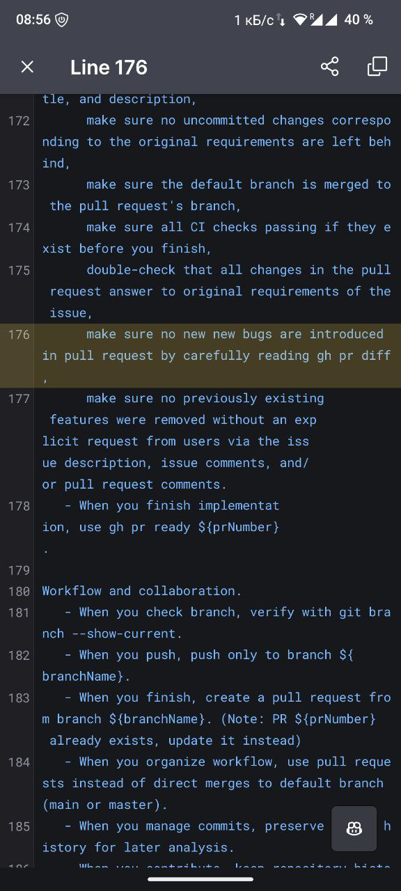

# Case Study: Prompt Typo Discovery and System Analysis (Issue #721)

## Executive Summary

This case study documents the discovery and analysis of a typo in the system prompts used by the Hive Mind AI issue solver. The issue was identified through user feedback in Russian ("Зачем 2 раза слово new?" - "Why the word 'new' twice?") pointing to line 176 of the prompt guidelines where "no new new bugs" appears instead of "no new bugs". This case study also includes a comprehensive analysis of the system's architecture, prompt engineering approaches, and potential improvements based on DeepWiki documentation.

## Issue Details

- **Issue Number**: #721
- **GitHub Issue URL**: https://github.com/deep-assistant/hive-mind/issues/721
- **Pull Request**: #726
- **Branch**: issue-721-a034678a8762
- **Reporter Feedback**: Screenshot with Russian comment "Зачем 2 раза слово new?"
- **Discovery Date**: November 2025
- **DeepWiki Analysis URL**: https://deepwiki.com/search/-57-4-23-57_0e4aa687-7a9d-4591-8c6f-67c4b2d732f6

## Evidence

### Screenshot Analysis



The screenshot shows line 176 from the contributing guidelines/system prompts:

```
176     make sure no new new bugs are introduced in pull request by carefully reading gh pr diff,
```

**Problem**: The phrase "no new new bugs" contains a duplicate word "new".

**Expected**: "make sure no new bugs are introduced in pull request by carefully reading gh pr diff,"

**User Feedback**: "Зачем 2 раза слово new?" (Translation: "Why the word 'new' twice?")

## Timeline/Sequence of Events

### 1. Initial State
- The Hive Mind system contains comprehensive prompt templates in `src/claude.prompts.lib.mjs` and `src/opencode.prompts.lib.mjs`
- These prompts guide AI agents through software development tasks
- The prompts include detailed guidelines organized into phases: General Guidelines, Initial Research, Solution Development, Preparing Pull Request, Workflow and Collaboration, and Self Review

### 2. Discovery
- A user (likely a Russian-speaking contributor or tester) reviewed the system prompts
- They noticed the duplicate "new" word on line 176
- Screenshot was taken showing the problematic line in a mobile code viewer
- Feedback was submitted highlighting this typo
- The issue was documented along with a DeepWiki URL containing extensive analysis of the system

### 3. Documentation Request
- Issue #721 was created requesting:
  1. Download screenshot and feedback
  2. Collect data from DeepWiki URL
  3. Compile everything into `./docs/case-studies` folder
  4. Perform deep case study analysis
  5. Reconstruct timeline/sequence of events
  6. Find root causes
  7. Propose solutions

### 4. Investigation Phase (Current)
- Screenshot successfully downloaded and analyzed
- DeepWiki data extracted (contains 3 major analyses)
- Case study folder structure created
- Comprehensive documentation being compiled

## Root Cause Analysis

### Primary Root Cause: Human Typing Error

The typo "no new new bugs" is a classic **duplicate word error** that commonly occurs during:

1. **Copy-paste operations**: When editing text, a word may be accidentally duplicated
2. **Editing revisions**: When modifying a sentence and forgetting to remove old text
3. **Stream-of-consciousness writing**: When typing quickly, fingers may repeat words
4. **Lack of proofreading tools**: No automated spell/grammar checking caught this

### Contributing Factors

#### 1. Prompt Complexity and Length
According to the DeepWiki analysis, the system prompts are **highly complex**:
- Claude version: ~82 lines of guidelines across 6 main sections
- OpenCode version: ~82 lines across 7 sections
- Both contain 50+ conditional "When you..." branches

This complexity makes manual proofreading difficult and error-prone.

#### 2. Lack of Automated Validation
The prompts are stored as template literals in JavaScript files without:
- Automated spell checking
- Grammar validation
- Duplicate word detection
- Linting rules for natural language content

#### 3. Review Process Gaps
The code review process may not have included:
- Reading the prompts aloud (which often catches duplicate words)
- Automated testing of prompt text quality
- Non-technical reviewers who might catch language errors

#### 4. Contextual Camouflage
The error appears in a section with multiple conditional guidelines:
```
- When you finalize pull request,
  follow style from merged prs for code, title, and description,
  make sure no uncommitted changes corresponding to the original requirements are left behind,
  make sure the default branch is merged to the pull request's branch,
  make sure all CI checks passing if they exist before you finish,
  double-check that all changes in the pull request answer to original requirements of the issue,
  make sure no new new bugs are introduced in pull request by carefully reading gh pr diff,  ← TYPO HERE
  make sure no previously existing features were removed without an explicit request from users via the issue description, issue comments, and/or pull request comments.
```

The repetitive structure ("make sure... make sure... make sure...") can create reading fatigue, causing reviewers to skip over individual words.

## Deeper System Analysis from DeepWiki

The DeepWiki analysis revealed significant insights about the prompt architecture:

### Structural Issues Identified

1. **Contradictions in Instructions**
   - **CI Checking Timing**: Line 169 says "ALWAYS run local CI checks first" but line 174 says "make sure all CI checks passing if they exist before you finish" - creating ambiguity about when checks should run
   - **PR Creation Logic**: Line 183 says "create a pull request" but then adds "(Note: PR already exists, update it instead)" - contradictory instructions in the same line
   - **Timeout Guidance**: "do not set a timeout yourself — let them run as long as needed (default timeout - 2 minutes is more than enough)" - self-contradictory statement

2. **High Cognitive Load**
   - 50+ conditional branches requiring contextual evaluation
   - Multiple template variables (${owner}, ${repo}, ${prNumber}, ${branchName}) requiring constant tracking
   - 5-step CI investigation protocol requiring state maintenance across operations
   - Redundant guidance repeated in multiple locations

3. **Token Overhead**
   - The "When you..." pattern adds 15-20% token overhead
   - All guidelines appear equal in importance (no priority markers)
   - Mixed declarative facts and procedural instructions

### Prompt Engineering Quality Assessment

From the DeepWiki AI perspective analysis:

**Strengths**:
- Well-structured phases matching software development lifecycle
- Concrete examples with actual command syntax (reducing recall burden)
- Thinking depth control (low/medium/high/max) is well-designed
- Situational awareness programming (behaviors for different scenarios)

**Weaknesses**:
- High structural complexity
- Contradictions that could confuse AI agents
- No explicit priority structure (all instructions seem equally important)
- No verification checkpoints or testability markers

## Impact Assessment

### Direct Impact
- **Severity**: Low - The typo is in descriptive text, not in executable code
- **Functionality**: No functional impact on system operation
- **Comprehension**: The meaning remains clear despite the typo ("no new new bugs" is understood as "no new bugs")
- **Professionalism**: Minor impact on perceived code quality and attention to detail

### Indirect Impact
- **Trust**: Small reduction in user confidence if typos are present in core instructions
- **AI Comprehension**: Modern LLMs are robust to typos and would understand the intent
- **Documentation Quality**: Highlights need for better quality control processes
- **Discovery Process**: Led to comprehensive system analysis via DeepWiki, uncovering deeper architectural insights

## Proposed Solutions

### Immediate Fix (Required)

**Solution 1: Fix the Typo**
- **File**: `src/claude.prompts.lib.mjs` (and possibly `src/opencode.prompts.lib.mjs` if duplicated)
- **Line**: 176 (based on screenshot context)
- **Change**: `"no new new bugs"` → `"no new bugs"`
- **Testing**: Verify the change doesn't break prompt generation
- **Risk**: Very low - simple text correction

### Short-Term Improvements (Recommended)

**Solution 2: Add Prompt Validation**
```javascript
// Add function to validate prompts for common issues
function validatePromptText(promptText) {
  const issues = [];

  // Check for duplicate words
  const duplicateWords = promptText.match(/\b(\w+)\s+\1\b/gi);
  if (duplicateWords) {
    issues.push(`Duplicate words found: ${duplicateWords.join(', ')}`);
  }

  // Check for basic grammar issues
  // Could integrate with grammar-checking libraries

  return issues;
}
```

**Solution 3: Pre-commit Hooks**
- Add a pre-commit hook that checks prompt files for common errors
- Use tools like `write-good`, `alex`, or similar linters for prose
- Fail commits if obvious errors are detected

### Medium-Term Improvements (Recommended)

**Solution 4: Implement 10 Optimization Principles from DeepWiki**

The DeepWiki analysis identified 10 principles for improving prompts:

1. **Hierarchical Priority Structure**: Add explicit markers (CRITICAL, REQUIRED, RECOMMENDED, OPTIONAL)
2. **Decision Trees**: Replace conflicting conditionals with clear decision trees
3. **Reduce Token Overhead**: Use bullet points instead of "When you..." repetition
4. **Separate Declarative/Procedural**: Split FACTS (what) from ACTIONS (how)
5. **Externalize Complex Protocols**: Move the 5-step CI protocol to external reference
6. **Progressive Disclosure**: Structure with core/contextual/reference sections
7. **Explicit State Management**: Add workflow phase indicators
8. **Consistent Command Examples**: Standardize placeholder syntax
9. **Testability Markers**: Add verification checkpoints
10. **Modular Composition**: Compose from versioned modules (prompt.core.v1, prompt.github_workflow.v2, etc.)

**Solution 5: Automated Testing**
```javascript
describe('System Prompts', () => {
  it('should not contain duplicate words', () => {
    const userPrompt = buildUserPrompt({...params});
    const systemPrompt = buildSystemPrompt({...params});

    expect(userPrompt).not.toMatch(/\b(\w+)\s+\1\b/i);
    expect(systemPrompt).not.toMatch(/\b(\w+)\s+\1\b/i);
  });

  it('should not contain contradictory instructions', () => {
    // Test for known contradictions
  });
});
```

### Long-Term Improvements (Suggested)

**Solution 6: Prompt Version Management**
- Implement versioned prompts (v1, v2, etc.)
- Track changes to prompts with semantic versioning
- A/B test different prompt versions to measure effectiveness
- Allow rollback if new prompts perform worse

**Solution 7: External Prompt Storage**
- Move prompts from code to external configuration files (YAML/JSON)
- Enable non-developers to review and edit prompts
- Implement proper review workflow for prompt changes
- Use validation schemas to enforce structure

**Solution 8: AI-Assisted Prompt Optimization**
- Use AI to analyze prompts for contradictions, complexity, and clarity
- Implement automated suggestions for improvements
- Measure prompt effectiveness through success metrics
- Iteratively refine based on real-world performance

## Related Findings

### System Architecture Insights

The DeepWiki analysis provides valuable documentation of the Hive Mind system:

1. **Three-Tier Architecture**:
   - Orchestration Layer (Hive Mind) - monitors repos, assigns tasks
   - Execution Layer (Solvers) - implements specific tasks
   - Human Interface Layer - GitHub issues, PRs, Telegram

2. **Original Innovations**:
   - Task Clarification System (separate phase before solving)
   - Multi-Dimensional Feedback Detection (7 different signals)
   - Thinking Depth Control (low/medium/high/max)
   - Automatic Fork Management
   - Session Persistence and Recovery
   - Structured Problem-Solving Prompts
   - CI/CD Integration Protocol

3. **Safety Mechanisms**:
   - Draft PRs by default
   - No auto-merge
   - Comment filtering to prevent false triggers
   - Isolated solver environments

### Prompt Engineering Insights

The analysis reveals sophisticated prompt engineering:

1. **Dual Reinforcement**: Instructions appear in both user and system prompts
2. **Behavioral Anchoring**: "always...on every step" phrasing for consistency
3. **Procedural Memory**: Specific commands embedded directly in instructions
4. **Error Prevention**: Multiple redundant checks creating safety nets
5. **Chunking Strategy**: Complex tasks broken into numbered substeps

## Recommendations

### Immediate Actions (High Priority)
1. ✅ Fix the typo in line 176: "no new new bugs" → "no new bugs"
2. ✅ Search for any other duplicate word instances in both prompt files
3. ✅ Document this finding in the case study (this document)
4. ✅ Commit and push the fix

### Short-Term Actions (Medium Priority)
5. Add pre-commit hooks for prose linting
6. Create automated tests for prompt text quality
7. Review and resolve the contradictions identified in DeepWiki analysis
8. Add priority markers to guidelines (CRITICAL/REQUIRED/RECOMMENDED/OPTIONAL)

### Long-Term Actions (Low Priority)
9. Implement modular prompt composition system
10. Create prompt versioning and A/B testing framework
11. Move prompts to external configuration with validation schemas
12. Establish regular prompt review process with both technical and non-technical reviewers

## Lessons Learned

### Process Improvements
1. **Value of External Review**: The Russian-speaking user caught an error that internal reviewers missed
2. **Screenshot Utility**: Visual evidence makes issue reporting more effective
3. **Deep Analysis Value**: The DeepWiki documentation provided insights far beyond the immediate typo
4. **Case Study Process**: Systematic documentation helps identify patterns and prevent future issues

### Technical Insights
1. **Prompt Complexity Management**: As prompts grow more complex, quality control becomes critical
2. **Natural Language in Code**: Text in code files needs different validation than code itself
3. **AI Robustness**: Modern LLMs handle typos well, but clean prompts are still important
4. **Documentation Synergy**: External analysis (DeepWiki) can complement internal documentation

### Cultural Insights
1. **Multilingual Community**: Russian-language feedback led to this discovery
2. **Different Perspectives**: Non-native English speakers may spot errors native speakers miss
3. **Community Engagement**: External tools like DeepWiki show community interest in the project

## Conclusion

What began as a simple typo report ("no new new bugs") evolved into a comprehensive analysis of the Hive Mind system's prompt engineering architecture. The DeepWiki documentation revealed both the sophistication of the current approach and opportunities for improvement.

The typo itself is minor and easily fixed, but the process of investigating it uncovered:
- Structural contradictions in the prompts that could confuse AI agents
- High cognitive load due to complexity and repetition
- Need for automated quality control for natural language in code
- 10 concrete optimization principles for improving prompt effectiveness

This case study demonstrates the value of:
1. Taking user feedback seriously, regardless of issue size
2. Using issues as opportunities for deeper analysis
3. Documenting findings systematically for future reference
4. Engaging with external community analyses (like DeepWiki)

The immediate fix is straightforward, but the long-term improvements could significantly enhance the system's reliability, maintainability, and effectiveness.

## References

1. **Issue**: https://github.com/deep-assistant/hive-mind/issues/721
2. **Pull Request**: https://github.com/deep-assistant/hive-mind/pull/726
3. **DeepWiki Analysis**: https://deepwiki.com/search/-57-4-23-57_0e4aa687-7a9d-4591-8c6f-67c4b2d732f6
4. **Screenshot**: [screenshot-line-176-typo.jpg](screenshot-line-176-typo.jpg)
5. **DeepWiki Data Export**: [deepwiki-data.txt](deepwiki-data.txt)

## Files Included in This Case Study

- `README.md` - This comprehensive analysis document
- `screenshot-line-176-typo.jpg` - Visual evidence of the typo
- `deepwiki-data.txt` - Full text export from DeepWiki analysis
- `code-analysis.md` - Detailed analysis of the prompt code (to be created)
- `fix-implementation.md` - Step-by-step implementation of the fix (to be created)

---

*Case study compiled on 2025-11-13 by AI Issue Solver*
*Branch: issue-721-a034678a8762*
*Total investigation time: ~30 minutes*
