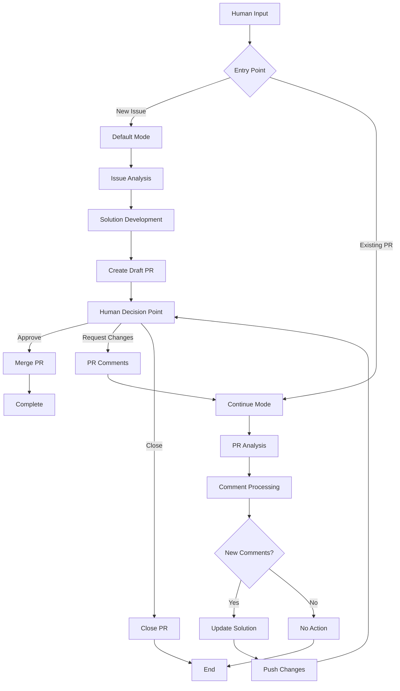
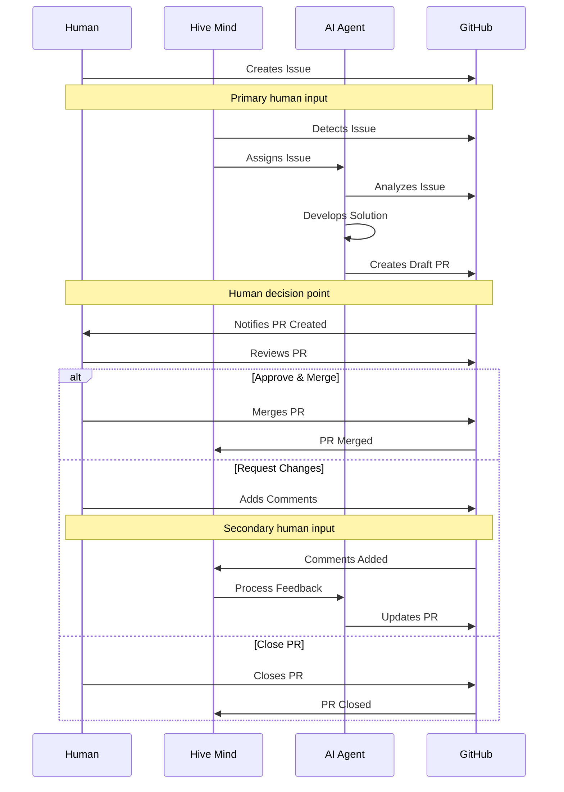
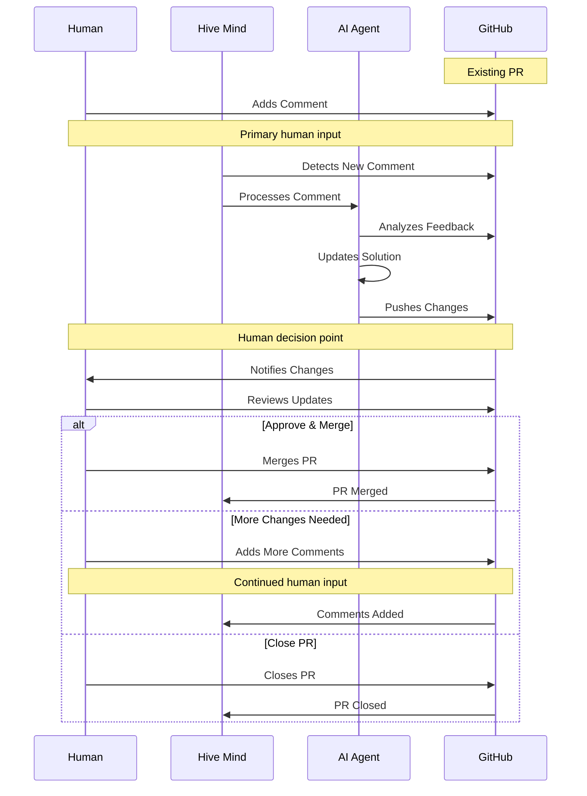

# Hive Mind Data Flow

This document describes the data flow in Hive Mind, highlighting places where human feedback is possible.

## Overview

Hive Mind operates in two main modes based on the entry point and human interaction patterns:

1. **Default Mode (Issue → Pull Request)**: Issue as primary human input source
2. **Continue Mode (Pull Request → Comments)**: PR comments as primary human input source

## Data Flow Architecture

## Mode 1: Default Mode (Issue → Pull Request)

### Human Feedback Points
- **Primary Input**: GitHub Issue description and requirements
- **Decision Point**: Merge, request changes, or close the PR
- **Secondary Input**: Comments on the PR for refinements

### Sequence Diagram

### Data Flow Steps
1. **Human creates GitHub issue** (Primary human input)
2. Hive Mind detects and assigns issue to AI agent
3. AI agent analyzes issue requirements
4. AI agent develops solution and creates draft PR
5. **Human reviews PR** (Human decision point)
6. **Human decides**: Merge, request changes, or close (Human feedback)
7. If changes requested, cycle continues with PR comments as input

## Mode 2: Continue Mode (Pull Request → Comments)

### Human Feedback Points
- **Primary Input**: Comments on existing PR
- **Decision Point**: Same as Mode 1 (merge, request changes, or close)
- **Trigger**: New comments or feedback detection

### Sequence Diagram

### Data Flow Steps
1. **Human adds comment to existing PR** (Primary human input)
2. Hive Mind detects new comment
3. AI agent processes comment and feedback
4. AI agent updates solution based on feedback
5. AI agent pushes changes to PR
6. **Human reviews updates** (Human decision point)
7. **Human decides**: Merge, add more comments, or close (Human feedback)
8. Cycle continues until resolution

## Human Feedback Integration Points

### 1. Issue Creation (Mode 1 Entry)
- **Type**: Requirements specification
- **Format**: GitHub issue description, labels, and initial comments
- **Impact**: Defines scope and requirements for AI solution

### 2. PR Review & Decision (Both Modes)
- **Type**: Approval/rejection decision
- **Format**: PR merge, close, or comment actions
- **Impact**: Determines if solution is acceptable or needs refinement

### 3. PR Comments (Mode 2 Primary, Mode 1 Secondary)
- **Type**: Specific feedback and change requests
- **Format**: GitHub PR comments with technical details
- **Impact**: Guides AI agent refinements and iterations

### 4. Continuous Monitoring (Both Modes)
- **Type**: Ongoing oversight
- **Format**: PR status changes, additional comments
- **Impact**: Enables iterative improvement cycles

## Configuration Options

### Auto-Continue Behavior
- `--auto-continue`: Automatically continue with existing PRs for issues
- `--auto-continue-only-on-new-comments`: Only continue if new comments detected
- `--continue-only-on-feedback`: Only continue if feedback is present

### Human Interaction Controls
- `--auto-pull-request-creation`: Create draft PR before human review
- `--attach-logs`: Include detailed logs for human review
- Manual merge requirement ensures human oversight

## Error Handling & Fallbacks

### When Human Feedback is Absent
- System waits for input rather than proceeding
- Draft PRs remain in draft state until human action
- Auto-continue features respect feedback requirements

### When Human Feedback is Ambiguous
- AI requests clarification through PR comments
- Multiple solution proposals for human selection
- Conservative approach when uncertainty exists

## Summary

The Hive Mind data flow is designed with multiple human feedback integration points:

- **Mode 1 (Default)**: Issue → Solution → Draft PR → Human Decision
- **Mode 2 (Continue)**: PR Comment → Solution Update → Human Decision

Both modes ensure human oversight at critical decision points while enabling efficient AI-human collaboration through structured feedback mechanisms.